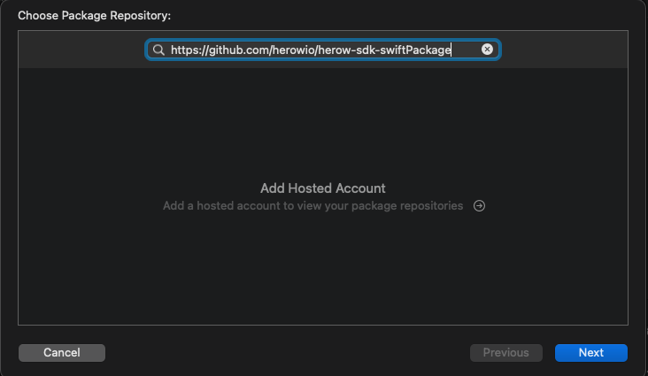

# Herow SDK for iOS

## Installation with CocoaPod

* Install CocoaPods  ```$ gem install cocoapods```
* At the root of the sample repository, check if a **Podfile** already exists and if not, create it. This can be done by running: ```$ touch Podfile```
* Add the following parameters to your Podfile:

```
source 'https://github.com/CocoaPods/Specs.git'
source 'https://github.com/herowio/Specs'

platform :ios, '9.0'

target 'YourtTarget' do
  use_frameworks!
  pod 'Herow', '~> 7.0.0'
  # Pods for QuickComplete

  # Pods for testing
  target 'QuickStartTests' do
    inherit! :search_paths
  end
  
  # Pods for testing UI
  target 'QuickStartUITests' do
    inherit! :search_paths
  end

	post_install do |installer|
        installer.pods_project.targets.each do |target|
            target.build_configurations.each do |configuration|
                configuration.build_settings['SWIFT_VERSION'] = "5.0"
                configuration.build_settings['SUPPORTS_UIKITFORMAC'] = 'NO'
                configuration.build_settings['SUPPORTS_MACCATALYST'] = 'NO'
            end
        end
    end

end
```

* Run ```$ pod update``` in your project directory


>**Note:**
>
>Your project is linked to the CoreLocation and CoreData frameworks
<!--{blockquote:.note}-->

## Installation with SwifPackage

* open Xcode swift package Manager and enter the following url:

 **https://github.com/herowio/herow-sdk-swiftPackage**



## Configure the SDK inside the AppDelegate

### Initialize the SDK

* Import HerowConnection module


#### Swift
```
import herow-sdk-ios
```
#### Objectiv-C
```
@import herow-sdk-ios;
```

* Add a HerowInitializer parameter to your AppDelegate

#### Swift
```
var herowInitializer: HerowInitializer?
```
#### Objectiv-C
```
@implementation AppDelegate {
    HerowInitializer *herowInitializer;
}
```


* In the **didFinishLaunchingWithOptions** method, initialize and configure the **HerowInitializer** object with your SDK credentials & environment, and launch synchronization with the **Herow Platform**


#### Swift
```
var herowInitializer: HerowInitializer?
```
```
func application(_ application: UIApplication, didFinishLaunchingWithOptions launchOptions: [UIApplication.LaunchOptionsKey: Any]?) -> Bool {
    herowInitializer = HerowInitializer.instance
    herowInitializer?.configPlatform(.prod).configApp(identifier: "your SDK ID", sdkKey: "your SDK Key").synchronize()
    return true
}
```
#### Objectiv-C
```
- (BOOL)application:(UIApplication *)application didFinishLaunchingWithOptions:(NSDictionary *)launchOptions {
    herowInitializer = [HerowInitializer instance];
    [[[herowInitializer configPlatform: HerowPlatform.prod]
        configAppWithIdentifier:@"your SDK ID" sdkKey:@"your SDK Key"] synchronize];
    return YES;
}
```

> **Note 1:**
>
> The **synchronize** method allows to set up the SDK with a configuration file downloaded from the **Herow platform**.
>
> The SDK will start the zone detection process only when the file download is complete.
>
> This configuration file is saved in cache, and the SDK checks for updates at regular intervals.
<!--{blockquote:.note}-->

>**Note 2:**
>
>The HerowInitializer allows you to configure your access to the **HEROW** platform.
> HEROW gives you access to one or several of the following environments:
>
>  - **preProd**: The pre-production platform of the **HEROW** platform
>  - **prod**: The production platform of the **HEROW** platform
<!--{blockquote:.note}-->

>**Warning:**
>
> You will get two different access keys:
>
>   - An access key to log into the HEROW Platform
>   - An access key to use with our mobile SDK. This access key is composed of an SDK ID and SDK Key on Herow. Please make sure you use the good credentials to connect the SDK to the **correct** Herow Platform, otherwise your application won't be able to detect zones.
<!--{blockquote:.warning}-->

## GDPR Opt-ins

The HEROW SDK only works if the GDPR opt-in is given by the end-user. The SDK can share some informations as user datas 


#### Update the opt-ins permissions


#### Objectiv-C

```
[herowInitializer instance] acceptOptin];
or 
[herowInitializer instance] refuseOptin];
```
#### Swift
```
 HerowInitializer.instance.acceptOptin()
 or
 HerowInitializer.instance.refuseOptin() 
```

> **Note 1:**
>
> If the user is refuse the optin the sdk will not work


## Setting a Custom ID
To set a custom ID, make the following call as soon as the user logs in.
If the user logout, you can use the removeCustomId method.
#### Swift

```
HerowInitializer.instance.setCustomId("customId")

HerowInitializer.instance.removeCustomId()
```
#### Objectiv-C

```
[HerowInitializer instance] setCustomId: "customId"];

[HerowInitializer instance] removeCustomId];
```


